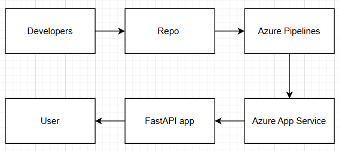

# Weather Watcher

Cloud-native web application built with FastAPI and deployed on Microsoft Azure. Get real-time weather information and 5-day forecasts for any city worldwide.

## Project Overview

Weather Watcher is a modern, responsive web application that provides:
- **Real-time weather data** for any city
- **5-day weather forecast** with daily high/low temperatures
- **City autocomplete** for quick city search
- **Beautiful dark-themed UI** with responsive design
- **Comprehensive monitoring** with Azure Application Insights

## Sprint Goals

- **Sprint 1:** Deploy a working application to Azure with automated CI/CD pipeline ✅
- **Sprint 2:** Implement core weather functionality and enhance monitoring capabilities ✅
- **Sprint 3:** Enhance user experience, improve reliability, and add advanced features 🔄

## Tech Stack

**Backend:**
- FastAPI (Python 3.11)
- Uvicorn/Gunicorn
- Pytest for testing
- OpenCensus for telemetry

**Frontend:**
- Vanilla JavaScript
- Modern CSS with dark theme
- Responsive design (mobile-first)
- Font Awesome icons

**Cloud & DevOps:**
- Microsoft Azure App Service
- Azure DevOps Pipelines (CI/CD)
- Azure Application Insights
- Azure Log Analytics

**APIs:**
- Google Maps Weather API (current conditions)
- Google Places API (autocomplete)
- OpenWeatherMap API (5-day forecast)

## Local Setup

### 1. Clone the repository

bash
git clone <your-repo-url>
cd weather-watcher

### 2. Install dependencies

bash
python -m venv venv
source venv/bin/activate # Windows: venv\Scripts\activate
pip install -r requirements.txt

### 3. Run the app

bash
uvicorn app.main:app --reload

Open http://localhost:8000 in your browser.

### 4. Run tests

bash
pytest tests/ -v
test deployment

## Features

### ✅ Sprint 2 Features (Completed)

- **Weather Search:** Search for weather by city name
- **Real-time Weather Data:** Current temperature, conditions, humidity, wind speed, pressure
- **City Autocomplete:** Smart city suggestions as you type
- **Modern UI:** Dark-themed, responsive design with smooth animations
- **Error Handling:** User-friendly error messages with retry functionality
- **Application Insights:** Custom telemetry and logging
- **Country Name Display:** Full country names instead of codes

### 🔄 Sprint 3 Features (In Progress)

- **5-Day Forecast:** Extended weather forecast with daily predictions
- **Enhanced Autocomplete:** Improved keyboard navigation and UX
- **Performance Optimization:** Caching and response time improvements
- **Monitoring Dashboard:** Comprehensive Application Insights dashboard
- **Enhanced Error Handling:** Retry logic and graceful degradation
- **Test Coverage:** >85% test coverage with comprehensive test suite

## API Endpoints

### Core Endpoints

- `GET /` - Homepage with weather search UI
- `GET /health` - Health check endpoint
- `GET /api/info` - Project information

### Weather Endpoints

- `GET /api/weather?city={city}` - Get current weather by city (query parameter)
- `GET /weather/{city}` - Get current weather by city (path parameter)
- `GET /api/forecast?city={city}` - Get 5-day weather forecast

### Utility Endpoints

- `GET /api/cities/autocomplete?query={query}` - City autocomplete suggestions
- `GET /api/debug` - Debug configuration (development only)

## Team

### Current Team (Sprint 3)

- **Product Owner:** Jack
- **Scrum Master:** Salmane
- **Developer 1 (Backend/API):** Omar
- **Developer 2 (Frontend):** Adrian
- **Developer 3 (Monitoring/Testing):** Kenny

### Sprint History

- **Sprint 1:** November 25-29, 2025 (5 days) - Infrastructure & Deployment
- **Sprint 2:** December 2-4, 2025 (3 days) - Core Weather Features
- **Sprint 3:** December 5-8, 2025 (4 days) - Enhancements & Optimization

## Documentation

### Project Documentation
- [Definition of Done](docs/definition-of-done.md)
- [Architecture Documentation](docs/architecture.md)
- [CI/CD Pipeline Documentation](docs/CI-CD-Pipeline-Documentation.md)

### Sprint Documentation
- [Sprint 1 Planning](docs/sprints/sprint1-planning.md)
- [Sprint 2 Planning](docs/sprints/sprint2-planning.md)
- [Sprint 2 Daily Scrum Notes](docs/sprints/sprint2-daily-scrum-notes.md)
- [Sprint 2 Retrospective](docs/sprints/sprint2-retrospective.md)
- [Sprint 3 Planning](docs/sprints/sprint3-planning.md)
- [Sprint 3 Retrospective](docs/sprints/sprint3-retrospective.md)

## Links

- _Azure DevOps:_ [https://adasilvaieu2023@dev.azure.com/adasilvaieu2023/devops%20group%20project%20Adrian/_git/weather%20watcher]
- _Live App:_ Coming soon

## Current Status

### ✅ Completed Features

- [x] Local development setup
- [x] FastAPI application with multiple endpoints
- [x] Azure App Service deployment
- [x] CI/CD pipeline with Azure DevOps
- [x] Weather API integration (Google Maps Weather API)
- [x] City autocomplete functionality
- [x] Modern responsive UI with dark theme
- [x] Application Insights monitoring
- [x] Comprehensive test suite
- [x] Error handling and user feedback
- [x] Country name conversion

### 🔄 In Progress (Sprint 3)

- [ ] 5-day forecast API integration (OpenWeatherMap)
- [ ] Enhanced monitoring dashboard
- [ ] Performance optimizations (caching)
- [ ] Test coverage >85%
- [ ] Enhanced error handling with retry logic

---

## Azure Deployment Information

### Resource Details

- **Resource Group:** BCSAI2025-DEVOPS-STUDENT-4B
- **App Service Plan:** asp-weather-watcher (F1 Free tier)
- **App Service Name:** weather-watcher-4B2025
- **Location:** North Europe
- **Runtime:** Python 3.11

### Live Application

- **URL:** https://weather-watcher-4b2025.azurewebsites.net

### Endpoints

- **Homepage:** https://weather-watcher-4b2025.azurewebsites.net/
- **Health Check:** https://weather-watcher-4b2025.azurewebsites.net/health
- **API Info:** https://weather-watcher-4b2025.azurewebsites.net/api/info
- **Weather API:** https://weather-watcher-4b2025.azurewebsites.net/api/weather?city=London
- **Forecast API:** https://weather-watcher-4b2025.azurewebsites.net/api/forecast?city=Madrid
- **Autocomplete:** https://weather-watcher-4b2025.azurewebsites.net/api/cities/autocomplete?query=New

### Deployment Status

- ✅ Application deployed successfully
- ✅ All endpoints verified working
- ✅ Build process configured with SCM_DO_BUILD_DURING_DEPLOYMENT=true
- ✅ CI/CD pipeline operational
- ✅ Application Insights monitoring active

## Architecture

### System Architecture Overview

The Weather Watcher application follows a cloud-native architecture:

1. **Frontend:** Single-page application served directly from FastAPI
2. **Backend API:** FastAPI application handling all API requests
3. **External APIs:** 
   - Google Maps Weather API (current conditions)
   - Google Places API (autocomplete)
   - OpenWeatherMap API (5-day forecast)
4. **Monitoring:** Azure Application Insights for telemetry and logging
5. **Deployment:** Azure App Service with CI/CD via Azure DevOps

## Azure Resources

**Resource Group:**  
`BCSAI2025-DEVOPS-STUDENT-4B`

**App Service:**  
`weather-watcher-4B2025`  
**URL:** weather-watcher-4b2025.azurewebsites.net

**Application Insights:**  
`ai-weather-watcher`

**Pipeline URL:**  
https://github.com/Oelhajjcheha/Devops-Project-WeatherWatcher/actions

---

### Additional Azure resources created automatically:

- **App Service Plan:** `asp-weather-watcher`
- **Log Analytics Workspace:** `e0b9cada-61bc-4b5a-bd7a-52c606726ef7`
- **Smart Detector Alert:** `Failure Anomalies - ai-weather-watcher`
- **Metric Alert:** `Failed requests`
- **Action Group:** `devops-alerts`
- **Shared Dashboard:** `83dea926-dda3-41c1-a7ac-03667ee213f3`
- **Azure Workbook:** `06a88c54-5b0a-4b9d-b670-e5522d9b51cb`

IE University - BCSAI - SDDO - 2025
