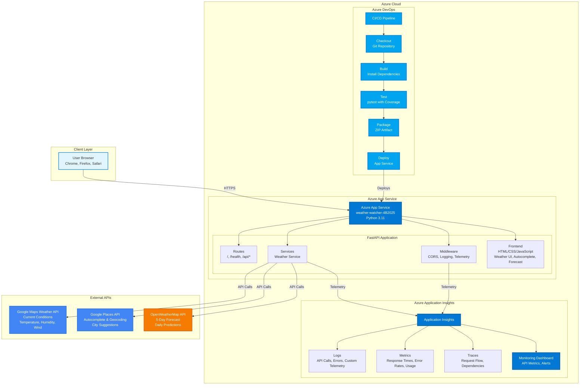

# Weather Watcher Architecture Documentation

**Last Updated:** December 5, 2025  
**Version:** 2.0 (Sprint 3)

---

## Architecture Overview

Weather Watcher is a cloud-native web application built with a modern microservices-inspired architecture, deployed on Microsoft Azure. The application follows best practices for scalability, reliability, and maintainability.

---

## System Architecture Diagram



### Alternative Text-Based Diagram

For environments that don't support Mermaid rendering, here's a simplified text representation:

```
User Browser
    │
    │ HTTPS
    ▼
Azure App Service (weather-watcher-4B2025)
    │
    ├── FastAPI Application
    │   ├── Routes (/health, /api/weather, /api/forecast, etc.)
    │   ├── Services (Weather Service)
    │   ├── Middleware (CORS, Logging, Telemetry)
    │   └── Frontend (HTML/CSS/JavaScript)
    │
    ├── External APIs
    │   ├── Google Maps Weather API (Current Conditions)
    │   ├── Google Places API (Autocomplete)
    │   └── OpenWeatherMap API (5-Day Forecast)
    │
    └── Azure Application Insights
        ├── Logs
        ├── Metrics
        ├── Traces
        └── Monitoring Dashboard

Azure DevOps Pipeline
    Checkout → Build → Test → Package → Deploy → App Service
```

---

## Component Details

### 1. Frontend Layer

**Technology:** HTML5, CSS3, Vanilla JavaScript

**Components:**
- **Weather Search Interface:** City input with autocomplete
- **Weather Display:** Current conditions with icons and metrics
- **Forecast Display:** 5-day forecast with daily predictions
- **Error Handling:** User-friendly error messages with retry functionality

**Features:**
- Responsive design (mobile-first)
- Dark theme UI
- Smooth animations and transitions
- Keyboard navigation support
- Accessibility features (ARIA labels)

### 2. Backend API Layer

**Technology:** FastAPI (Python 3.11)

**Key Modules:**

#### Routes (`app/main.py`)
- `/` - Homepage with embedded frontend
- `/health` - Health check endpoint
- `/api/info` - Project information
- `/api/weather` - Current weather (query parameter)
- `/weather/{city}` - Current weather (path parameter)
- `/api/forecast` - 5-day weather forecast
- `/api/cities/autocomplete` - City autocomplete suggestions
- `/api/debug` - Debug configuration (development)

#### Services (`app/services/weather_service.py`)
- **WeatherService:** Main service for weather data
  - `get_weather_by_city()` - Fetch current weather
  - `get_forecast_by_city()` - Fetch 5-day forecast
  - `_geocode_city()` - Convert city name to coordinates
  - `_fetch_weather()` - Call Google Weather API
  - `_parse_weather_response()` - Format API response

#### Middleware
- **CORS Middleware:** Enable cross-origin requests
- **Logging Middleware:** Request/response logging
- **Telemetry Middleware:** Application Insights integration

### 3. External API Integrations

#### Google Maps Weather API
- **Purpose:** Current weather conditions
- **Endpoint:** `https://weather.googleapis.com/v1/currentConditions:lookup`
- **Data Provided:**
  - Temperature (Celsius)
  - Weather conditions
  - Humidity
  - Wind speed
  - Atmospheric pressure
  - Feels-like temperature

#### Google Places API
- **Purpose:** City autocomplete and geocoding
- **Endpoints:**
  - Autocomplete: `https://maps.googleapis.com/maps/api/place/autocomplete/json`
  - Geocoding: `https://maps.googleapis.com/maps/api/geocode/json`
- **Data Provided:**
  - City suggestions
  - Geographic coordinates
  - Country information

#### OpenWeatherMap API
- **Purpose:** 5-day weather forecast
- **Endpoint:** `https://api.openweathermap.org/data/2.5/forecast`
- **Data Provided:**
  - Daily high/low temperatures
  - Weather conditions
  - Forecast icons

### 4. Monitoring and Observability

#### Azure Application Insights
- **Logging:** Custom telemetry for weather searches
- **Metrics:** Response times, error rates, API call counts
- **Traces:** Request flow and dependencies
- **Alerts:** Configured for critical errors

#### Custom Telemetry
- Weather search events (city, success/failure, temperature)
- Autocomplete usage statistics
- API response times
- Error tracking with context

### 5. Deployment Infrastructure

#### Azure App Service
- **Service Name:** weather-watcher-4B2025
- **Plan:** F1 Free tier
- **Runtime:** Python 3.11
- **Region:** North Europe
- **Configuration:**
  - Environment variables for API keys
  - Build configuration (SCM_DO_BUILD_DURING_DEPLOYMENT)
  - Application Insights integration

#### CI/CD Pipeline (Azure DevOps)
- **Trigger:** Push to `main` branch
- **Stages:**
  1. Checkout source code
  2. Build (install dependencies)
  3. Test (pytest with coverage)
  4. Package (ZIP artifact)
  5. Deploy (Azure App Service)

---

## Data Flow

### Weather Search Flow

```
1. User enters city name in search box
   ↓
2. Frontend sends GET /api/weather?city={city}
   ↓
3. Backend validates city name
   ↓
4. WeatherService.geocode_city() → Google Geocoding API
   ↓
5. WeatherService.fetch_weather() → Google Weather API
   ↓
6. Backend formats response
   ↓
7. Frontend displays weather data
   ↓
8. Application Insights logs telemetry
```

### Autocomplete Flow

```
1. User types in search box (2+ characters)
   ↓
2. Frontend debounces input (300ms)
   ↓
3. Frontend sends GET /api/cities/autocomplete?query={query}
   ↓
4. Backend calls Google Places Autocomplete API
   ↓
5. Backend formats suggestions
   ↓
6. Frontend displays dropdown with suggestions
   ↓
7. User selects or continues typing
```

### Forecast Flow

```
1. User searches for weather
   ↓
2. Frontend automatically fetches forecast
   ↓
3. Frontend sends GET /api/forecast?city={city}
   ↓
4. Backend calls OpenWeatherMap Forecast API
   ↓
5. Backend groups hourly data by day
   ↓
6. Backend calculates daily min/max temperatures
   ↓
7. Frontend displays 5-day forecast cards
```

---

## Security Considerations

### API Key Management
- API keys stored in Azure App Service environment variables
- Never committed to version control
- Rotated periodically

### Input Validation
- City name validation (length, characters)
- SQL injection prevention (no database, but good practice)
- XSS prevention (input sanitization)

### CORS Configuration
- Currently allows all origins (development)
- Should be restricted in production

---

## Performance Optimizations

### Current Implementation
- Async/await for non-blocking API calls
- Efficient data parsing
- Minimal frontend dependencies

### Planned (Sprint 3)
- Response caching (5-minute TTL)
- Rate limiting to prevent abuse
- Parallel API calls where possible
- Frontend asset optimization

---

## Scalability Considerations

### Current Architecture
- Single Azure App Service instance
- Stateless application design
- External API dependencies

### Future Enhancements
- Horizontal scaling (multiple instances)
- Load balancing
- Caching layer (Redis)
- CDN for static assets

---

## Error Handling Strategy

### Backend Error Handling
- Custom exceptions (CityNotFoundError, WeatherAPIError)
- HTTP status codes (400, 404, 500, 503, 504)
- User-friendly error messages
- Retry logic for transient failures

### Frontend Error Handling
- Try-catch blocks for API calls
- User-friendly error messages
- Retry button functionality
- Graceful degradation

---

## Testing Strategy

### Unit Tests
- Service layer tests
- Validation function tests
- Utility function tests
- Mock external APIs

### Integration Tests
- API endpoint tests
- End-to-end flow tests
- Error scenario tests

### Test Coverage
- Target: >85% coverage
- Critical paths: 100% coverage
- Edge cases: Comprehensive testing

---

## Dependencies

### Backend Dependencies
```
fastapi==0.104.1
uvicorn[standard]==0.24.0
pytest==7.4.3
pytest-asyncio==0.21.1
httpx==0.25.2
python-dotenv==1.0.0
gunicorn==21.2.0
opencensus
opencensus-ext-azure
pydantic>=2.0.0
```

### External Dependencies
- Google Maps API (Weather, Places, Geocoding)
- OpenWeatherMap API (Forecast)
- Azure services (App Service, Application Insights, DevOps)

---

## Environment Configuration

### Required Environment Variables
- `GOOGLE_MAPS_API_KEY` - Google Maps API key
- `OPENWEATHER_API_KEY` - OpenWeatherMap API key
- `APPLICATIONINSIGHTS_CONNECTION_STRING` - Application Insights connection

### Optional Environment Variables
- `ENVIRONMENT` - Environment name (development/production)
- `LOG_LEVEL` - Logging level

---

## Future Architecture Enhancements

### Short-term (Sprint 4+)
- Database for caching weather data
- User preferences storage
- Favorite cities feature

### Long-term
- Microservices architecture
- Message queue for async processing
- Real-time updates via WebSockets
- Mobile app (React Native)

---

**Document Created:** December 5, 2025  
**Author:** Development Team  
**Version:** 2.0  
**Status:** Current

